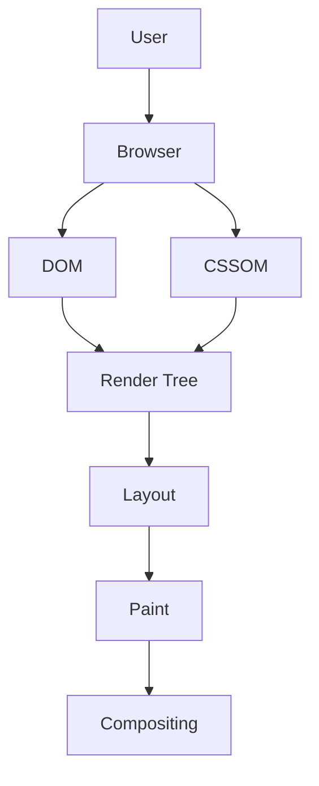
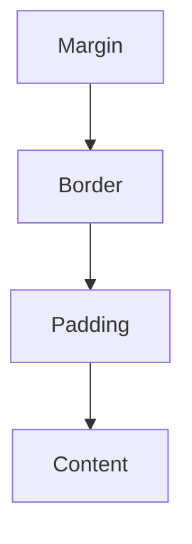
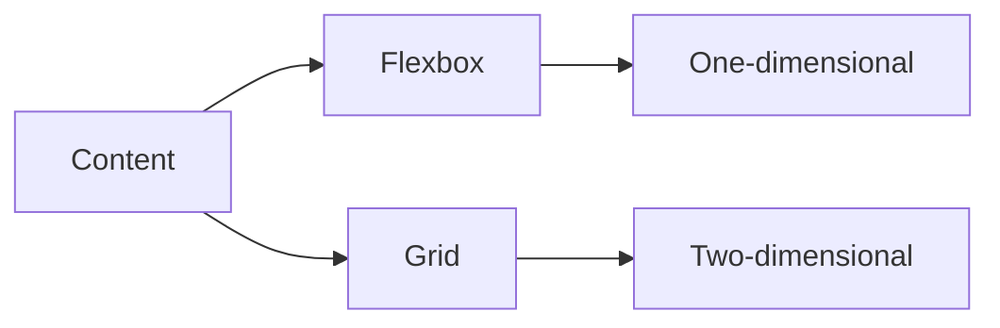
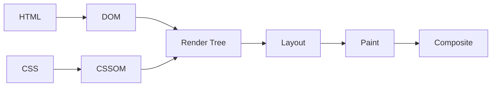
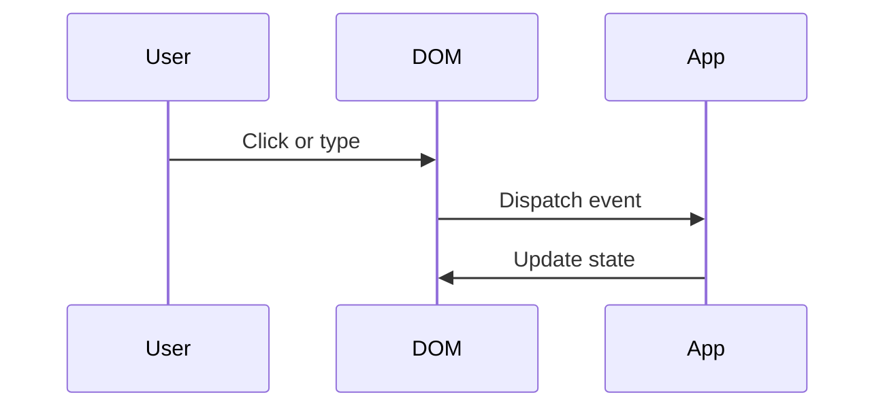
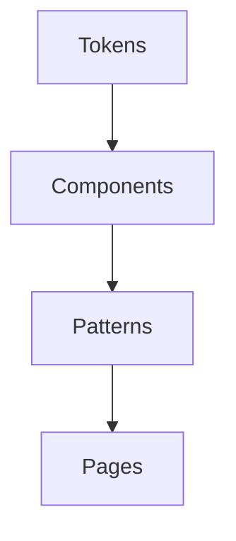
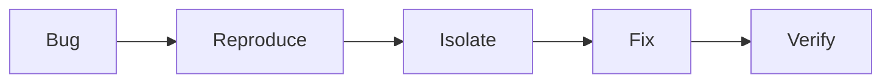

# 🦸 My Front End System Design Notes
## Course Notes: Front End Masters

> *Personal notes, diagrams, and key takeaways from the Front End System Design course.*

---

### 📖 Table of Contents
- [Chapter 1: The Browser Mental Model](#chapter-1-the-browser-mental-model)
- [Chapter 2: Box Model, Display, and Flow](#chapter-2-box-model-display-and-flow)
- [Chapter 3: Flexbox, Grid, and Responsive Layout](#chapter-3-flexbox-grid-and-responsive-layout)
- [Chapter 4: Positioning, Stacking, and Containment](#chapter-4-positioning-stacking-and-containment)
- [Chapter 5: Rendering Pipeline and Performance](#chapter-5-rendering-pipeline-and-performance)
- [Chapter 6: DOM, Events, and Forms](#chapter-6-dom-events-and-forms)
- [Chapter 7: State, Data, and Server Communication](#chapter-7-state-data-and-server-communication)
- [Chapter 8: Accessibility and Inclusive UI](#chapter-8-accessibility-and-inclusive-ui)
- [Chapter 9: Design Systems and Component Architecture](#chapter-9-design-systems-and-component-architecture)
- [Chapter 10: Security, Privacy, and Risk](#chapter-10-security-privacy-and-risk)
- [Chapter 11: Testing, Debugging, and Observability](#chapter-11-testing-debugging-and-observability)
- [Chapter 12: Interview Drills and Real-World Patterns](#chapter-12-interview-drills-and-real-world-patterns)
- [The Front End Architect's Cheat Sheet](#the-front-end-architects-cheat-sheet)

---

## 🧠 Chapter 1: The Browser Mental Model

### What is a Front End System?
At its core, a front end system is a collection of browser, layout, interaction, and data layers working together to create a usable experience.

Every strong UI system has three questions underneath it:
1. What is being shown?
2. How is it being laid out and rendered?
3. How does the user interact with it across devices, browsers, and network conditions?

### The Interconnected Web
The best front end engineers understand the system around the UI:
- How do design, product, and engineering decisions shape the interface?
- How do component constraints affect layout and accessibility?
- How do browser rules affect performance and behavior?

> **Insight:** Two UIs can use the same components and still behave very differently depending on layout mode, content size, browser quirks, and performance budgets.

### Try This
- Ask which parts of a UI are browser-driven versus app-driven.
- Ask whether a bug is caused by content, CSS, rendering, or state.
- Ask what changes when the screen becomes smaller or the content becomes larger.

---

## 🛠️ Chapter 2: Box Model, Display, and Flow

### The Box Model
The four layers of an HTML element's box model are content, padding, border, and margin.

### What are the two types of box size in CSS?
Use the standard mental model:
- Intrinsic sizing: the element sizes itself from content.
- Extrinsic sizing: the element is constrained by CSS, the parent, or available space.

### What are the main characteristics of block-level boxes?
Block-level boxes participate in block flow.
- They start on a new line in normal document flow.
- They typically stretch to fill available width.
- They respect width and height.
- Vertical margins affect spacing.

### What are the key differences between inline and block-level elements?

| Inline | Block |
| :--- | :--- |
| Flows with text | Creates structural sections |
| Stays in a line box | Starts a new line in normal flow |
| Usually ignores width and height | Respects width and height |
| Vertical margins behave differently | Vertical margins affect layout normally |

### What determines the height of an inline element?
Inline height is driven by line boxes, font metrics, and line-height.

> **Common trap:** inline height is not handled like block height. It is negotiated by the line formatting context.

### Try This
- Compare `display: inline`, `inline-block`, and `block` with the same content.
- Ask what breaks when the text becomes longer or the screen becomes smaller.

---

## 🧱 Chapter 3: Flexbox, Grid, and Responsive Layout

### Flexbox
Flexbox is for one-dimensional layout: rows or columns.
- Best for alignment and distribution along one axis.
- Great for nav bars, toolbars, card rows, and centered controls.

### Grid
Grid is for two-dimensional layout: rows and columns together.
- Best for dashboards, shells, and complex page structure.
- Great when both axes matter.

### Responsive Thinking
Responsive design is not only about shrinking the screen.
- Design for content growth.
- Design for localization.
- Design for containers, not just viewports.

### Try This
- Build the same layout with Flexbox and Grid.
- Ask which version is easier to maintain when content changes.
- Ask which version breaks first on mobile.

---

## 📍 Chapter 4: Positioning, Stacking, and Containment

### Positioning Modes
- `relative`: stays in flow, but becomes a reference point.
- `absolute`: removed from normal flow and positioned against a containing block.
- `fixed`: anchored to the viewport.
- `sticky`: switches behavior after scrolling.

### Stacking Contexts
Stacking contexts decide what paints on top of what.
- They matter for dropdowns, modals, and overlays.
- z-index only behaves as expected inside the same stacking context.

### Common Mistake
Using `absolute` to solve every layout problem usually creates more problems later.

---

## ⚙️ Chapter 5: Rendering Pipeline and Performance

### What the Browser Does
The browser parses, calculates layout, paints, and composites.

### Why It Matters
- Layout changes can be expensive.
- Paint changes can be expensive.
- Too many DOM updates hurt smoothness.

### Ask Yourself
- Is this a layout problem, a network problem, or a data problem?
- Did one state change trigger too much work?

---

## 🧩 Chapter 6: DOM, Events, and Forms

### Events
- Events bubble from target to ancestors.
- Event delegation keeps listeners scalable.

### Forms
- Controlled inputs give the app full control.
- Uncontrolled inputs let the browser own more state.

### Try This
- Explain why event delegation is better for dynamic lists.
- Describe the trade-off between controlled and uncontrolled inputs.

---

## 🔄 Chapter 7: State, Data, and Server Communication

### Types of State
- Local state
- Shared state
- Server state
- URL state

### Core Question
Should the UI wait for fresh data or show cached data first?

That answer depends on whether the screen is read-heavy, time-sensitive, or safety-critical.

---

## ♿ Chapter 8: Accessibility and Inclusive UI

Accessibility is not an add-on. It changes structure, focus flow, and testing.

- Use semantic HTML.
- Support keyboard navigation.
- Manage focus carefully.
- Respect motion and contrast needs.

> **Check:** Can this interface still be used without a mouse?

---

## 🧱 Chapter 9: Design Systems and Component Architecture

### What a Design System Does
- Shared tokens for color, spacing, typography, and motion.
- Reusable components with clear contracts.
- Patterns for loading, empty, error, and success states.

### Try This
- Ask which parts of a component are stable and which parts should be configurable.
- Ask whether a shared component is truly reusable or only looks reusable.

---

## 🔒 Chapter 10: Security, Privacy, and Risk

- Do not leak secrets into the browser.
- Escape untrusted content properly.
- Be careful with third-party scripts.
- Treat browser storage as user-visible, not secret storage.

> **Question:** What can an attacker do with data visible in the browser?

---

## 🧪 Chapter 11: Testing, Debugging, and Observability

### What to Test
- Unit tests for logic-heavy behavior.
- Integration tests for user flows.
- End-to-end tests for critical paths.

### Debug Loop

### Try This
- When a UI bug appears, classify it as state, layout, rendering, or data.
- Decide what should be unit tested versus integration tested.

---

## 🎯 Chapter 12: Interview Drills and Real-World Patterns

### Common Prompts
- Design a responsive dashboard.
- Design an autosave editor.
- Design an infinite feed.
- Design a notification center.

### How to Answer
1. Clarify requirements.
2. Identify layout and interaction constraints.
3. Explain state and data flow.
4. Call out trade-offs.
5. Mention performance and accessibility.

---

## The Front End Architect's Cheat Sheet

> **Complex is easy. Simple is hard.**

| If you need... | Consider... |
| :--- | :--- |
| Fast repeated reads | Caching |
| One-dimensional alignment | Flexbox |
| Two-dimensional structure | Grid |
| Overlays and popups | Positioning and stacking context |
| Large team consistency | Design system |
| Inclusive UX | Semantic HTML and keyboard support |
| Smooth interaction | Reduce unnecessary rendering work |

---

## Notes for Future Questions

When you dump more questions, I can keep converting them into this format and add:

- clearer explanations
- diagrams
- examples from real products
- common pitfalls
- interview-ready answers
- linked topics so the guide feels connected instead of fragmented

---

> *This note set is intentionally unfinished. The goal is to keep turning questions into a connected learning system.*
